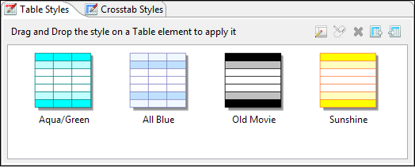
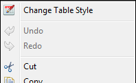
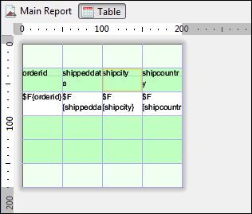
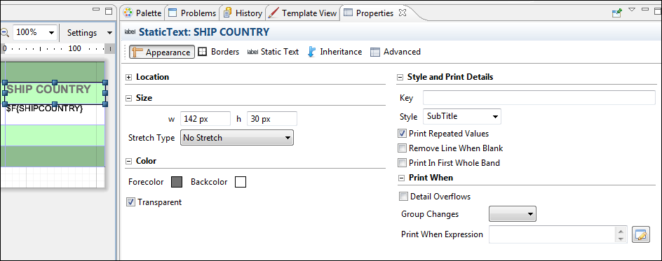
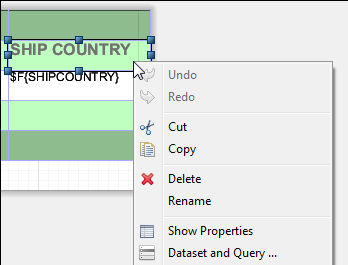
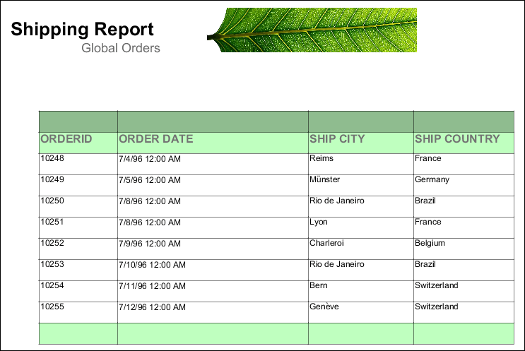
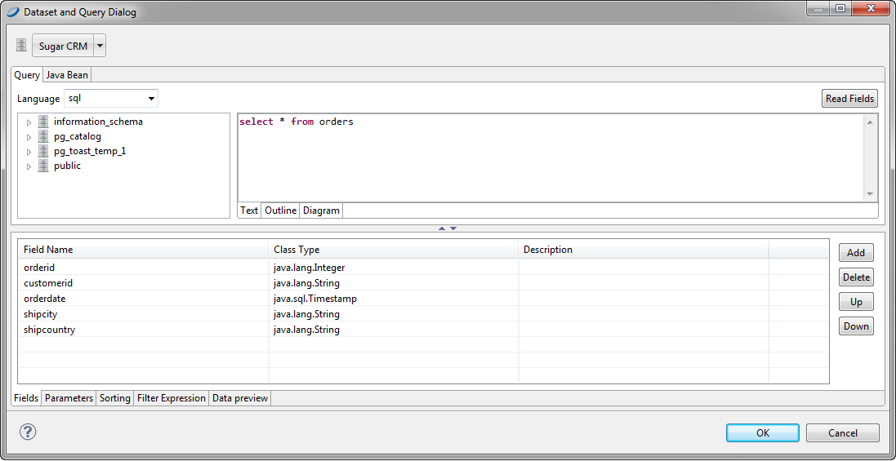

# Editing a Table

## Editing Table Properties

You can edit the following on the **Tables** tab in the **Properties** view:

- **Name**: Enter a name for the table. The name appears in the outline view.
- **Fit columns to table element**: Select this to have the columns automatically stretch or shrink to fit the table width.
- **Resize the columns taking the space from the next one**: Select this to configure the table so that resizing a column by moving its border means one column grows wider and the other narrower.

## Editing Table Styles

You can edit the look and feel of a table by choosing elements from the **Table Styles** tab. To create a style, click the new style button . In the **Table Wizard Layout** window, you can select a style to add to your palette or create a style to save to your palette.

|                                                         |
|---------------------------------------------------------|
|  |
| *Figure 1: Table Styles Tab*                            |

To edit a style in the palette, double-click the style and edit it in the **Layout** window. You can save it either as a new style or with the same name. To edit the table layout in the **Design** tab, right-click the table and choose **Change Table Style**.

|                                                                       |
|-----------------------------------------------------------------------|
|  |
| *Figure 2: Change Table Style*                                        |

You can also decide which table sections to create. If the dataset for the table contains groups, it can be convenient to select the **Add Group Headers** and **Add Group Footers** checkboxes.

To delete a style, right-click it in the **Table Styles** tab and choose **Delete Style**.

## Editing Cell Contents

You can edit the content, style, and size of each cell or group of cells in your table.

- To edit table content, double-click your table. The table opens in a separate tab inside the **Design** tab for your report.

|                                                           |
|-----------------------------------------------------------|
|  |
| *Figure 3: Table Editing Tab*                             |

- To edit the content and style of a cell, click the cell. Switch to the **Properties** view where you can edit location, size, color, style, and print details for the cell.

|  |
|----|
|  |
| *Figure 4: Cell with Properties View* |

- To edit the size and position of a cell, or copy or delete it, right-click on the cell and select an action from the context menu.

|  |
|----|
|  |
| *Figure 5: Cell Right-Click Menu* |

- Use Shift-click to select all cells in a row.
- See [Working with Columns](tables-working-with-columns.md) for information about working with columns.

The following figure is the table created in [Creating a Table](tables-creating.md), after formatting and editing:

|                                                       |
|-------------------------------------------------------|
|  |
| *Figure 6: Formatted Table*                           |

## Editing Table Data

You can edit the dataset used for the table by right-clicking the table and selecting **Dataset and Query** to display the **Dataset and Query** Dialog.

|  |
|----|
|  |
| *Figure 7: Dataset and Query Dialog* |

Here you can set the dataset parameters to filter the data used in the table dynamically.

Suppose, for instance, you have a report that displays order details in a table, you can use a parameter in your SQL query to specify the order ID to filter the order details.

!!! note

    Unlike charts and crosstabs, a table always requires a subdataset. Tables cannot use the main dataset.

## Editing Table Source

You can also edit tables using the **Source** tab. In the source, the tags are labeled as follows:

- `Table`: External border of the table.
- `Table_TH`: Table header background color and cell borders.
- `Table_CH`: Table column background.
- `Table_TD`: Detailed cell style. `Table_TD` can be nested to display alternating background color for the detail rows.
