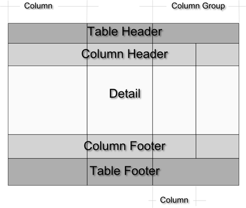
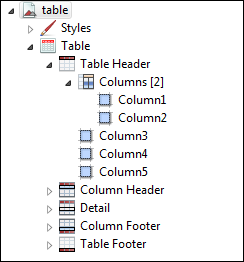

# Table Structure

Tables consist of cells and columns. This section provides more information about working with each of these elements.

## Table Elements

A table must have at least one column, but it can have any number. A set of columns can be collected into a column group with a heading that spans several or all the columns.

Each table is divided into sections similar to the main document bands:

- **Table header and footer**: each printed only once.
- **Column header and footer**: repeated on each page the table spans. For column groups, the table can display a group header and footer section for each group and for each column.
- **Detail**: repeated for each record of the table. Each column contains only one detail section, and the section cannot span multiple columns.

|                                                       |
|-------------------------------------------------------|
|  |
| *Figure 1: Table Structure*                           |

In the **Outline** view, table sections are shown as child nodes of the table element node.

|                                                             |
|-------------------------------------------------------------|
|  |
| *Figure 2: Table in Outline View*                           |

In the **Design** tab, each column has a cell for each section (for example, one cell for the table header section, another for the table footer). A cell can be undefined. If all the cells of a section are undefined, the section is not printed. If the height of all the cells of a section is zero, the section is printed but is not visible in the **Design** tab.

## Table Cells

A cell can contain any JasperReports element. When an element is dropped on a cell, Jaspersoft Studio automatically arranges the element to fit the cell size. To change the arrangement of the elements, right-click the cell (or element) and select an option from the context menu. Alternatively, you can insert a frame element in the cell and add all the required elements in that frame.

You can delete a cell by right-clicking and choosing **Delete cell**. If the cell is the only defined cell in the column, the entire column is removed. Similarly, if a cell is undefined, right-click it and select **Add cell** to create the cell. An undefined cell is automatically created when the user drags an element into it (see [Working with Columns](tables-working-with-columns.md)).

Edit cell properties from the **Properties** tab:

- The **Appearance** sub-tab allows you to set location, size, color, style, and print details.
- You can set cell padding as well as borders from the **Properties \> Borders** tab.
- Cell height defines the vertical dimension of a cell. When its value is changed, the new dimension is propagated to all the cells in the row.
