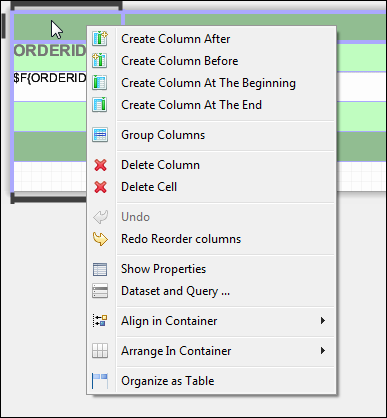
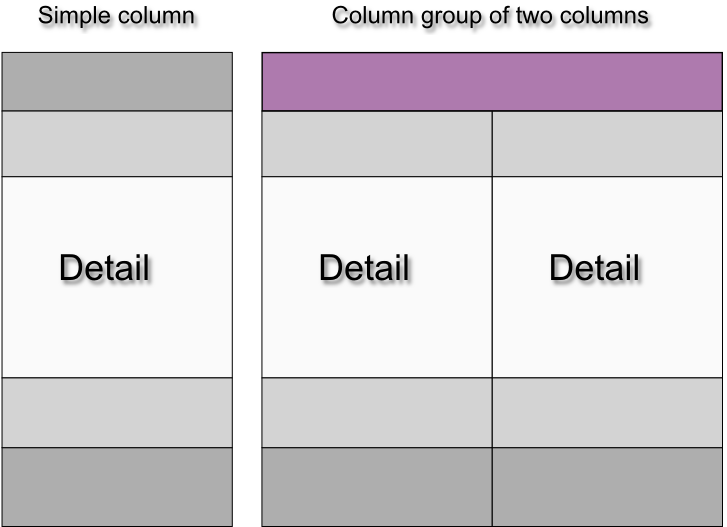
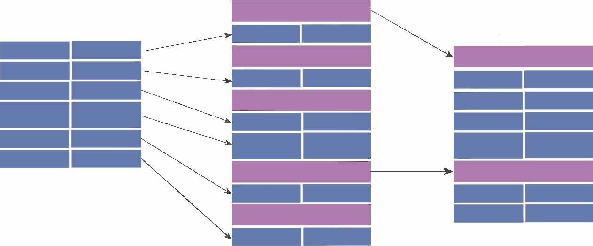

# Working with Columns

There are a number of tools that can help you lay out the columns of a table.

## Table Properties for Managing Columns

Use the following settings on the Table tab in the Properties view to control column behavior:

-   To expand the columns to fit the table width, select **Fit columns to table element**.
-   To configure the table so that resizing a column by moving the border means one column grows wider and the other narrower, select **Resize the columns taking the space from the next one**.

## Working with Individual Columns

To edit individual columns, double-click your table. The table opens in a separate tab inside the Design tab for your report. Here you can do the following:

-   To edit cell content, double-click the column and enter the new content in the editor. See [Editing Cell Contents](tables-editing.md) for more information.

-   To resize a cell, click a cell with content to display its handles, then click and drag on any handle.

-   To resize a column or row, click in an empty cell in the column. The selected row or column is outlined. Drag the outline to resize.

-   To add and delete columns, click in the column header or footer. The selected row and column are outlined. Select an option from the action menu. By default, when Jaspersoft Studio adds a column to a table, the new column inherits the properties of the other columns.

    |                                                             |
    |-------------------------------------------------------------|
    |  |
    | *Figure 1 Column Context Menu*                              |

-   Table cells are containers that can include other elements. To set a layout for the cell contents, click in the column header or footer and select Arrange in Container from the action menu, then select a layout option. See [Positioning Elements in Containers.](elements/elements-inserting-selecting-postioning.md)

-   You can drag a column to any position, inside or outside a group. Move a column within the same section by dragging the nodes that represent the columns in the outline view.

## Column Groups

A column is composed of a set of cells. If you create a column group, a column heading can span all columns in the group. A column group can include other column groups.

|                                                   |
|---------------------------------------------------|
|  |
| *Figure 2 Simple Column vs. Column Group*         |

A column group acts as a single unit when you drag it. If you drag the last column out of a column group, the column becomes a simple column and the remaining group cells are deleted.

When you create a column group, every column section gets a group heading, as shown in “Group headings”, but you can remove unnecessary headings. On the left of the figure, there are two columns (most of the sections in the columns have only one record; one section has two records). When the columns are grouped, each column section gets a group heading, as shown in the center. However, most of the group headings are unnecessary, so their heights have been set to zero to hide them, as shown on the right.

|                                                       |
|-------------------------------------------------------|
|  |
| *Figure 3 Group headings*                             |
