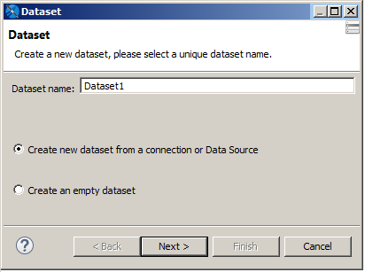
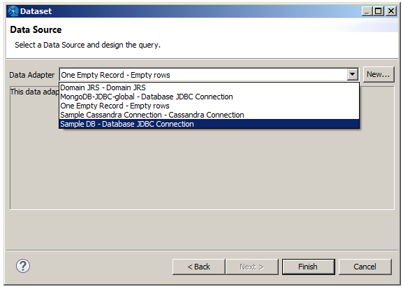
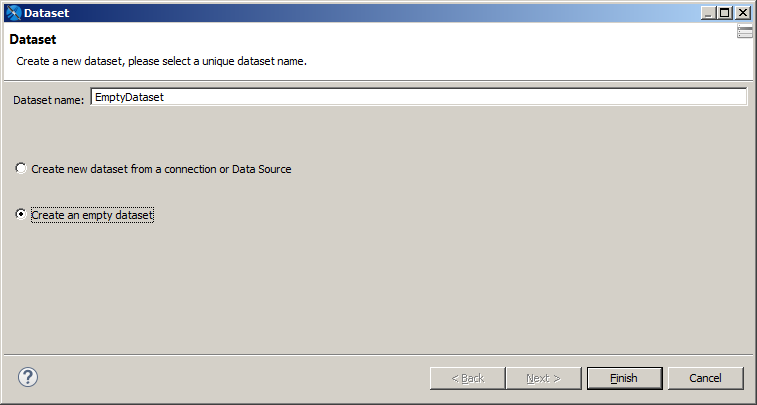

Create a subdataset

1.  Right-click your report's root node in the outline view.

2.  Select **Add Dataset** from the context menu.

    The Dataset wizard is displayed.

    |                                                             |
    |-------------------------------------------------------------|
    |  |
    | Creating a new subdataset                                   |

3.  Enter a name for your dataset. For this tutorial, name it ExampleDataset.

4.  For this tutorial, select **Create new dataset from a connection or Data Source**. This includes a data adapter as part of your dataset definition.

    !!! note

        If you select **Create an empty dataset**, your dataset does not include any data adapter or field information. You need to configure this information separately for each dataset run.

5.  Click **Next**.

6.  Select the data source that you want for your dataset. For this example, select Sample DB.

    |  |
    |----|
    |  |
    | Data Source page of the Dataset wizard |

7.  Create a subdataset query and set it to:

    `select SHIPCOUNTRY, COUNT(*) country_orders from ORDERS group by SHIPCOUNTRY`

    The fields are registered in the subdataset (see Figure 14‑8).

    |                                  |
    |----------------------------------|
    |                                  |
    | The subdataset to fill the chart |

8.  For this tutorial, select **Create an empty dataset**. There is no data adapter currently defined for this dataset. You configure this information later when you create a dataset run.

9.  Click **Finish**. The dataset is created and appears in outline view for the report.

10. Select the dataset in outline view.

11. On the Dataset tab of the properties view for the dataset, select **Edit query, filter and sort options**. In the Dataset and Query dialog, enter the query:

    `select SHIPCOUNTRY, COUNT(*) country_orders from ORDERS group by SHIPCOUNTRY`

    Note that no fields are detected, because there is no data adapter for this data set. However, it is still possible to set the query.

12. Click **OK** to save the query.

Create a chart and its dataset run

1.  Now drag the Chart element to the summary band.
2.  Select the Pie Chart when prompted and click **Next**.
3.  In the dataset run section, select the dataset we have created, EmptyDataset.
4.  Select **Use same JDBC connection used to fill the master report** from the dropdown menu. This causes the expression to be set automatically to the connection used by the main report (`$P{REPORT_CONNECTION}`).
5.  To allow the expression context to update the fields, parameters, and values, after the dataset run configuration you should close the dialog to force an update with your changes, then reopen it. You should now be able to edit the subdataset fields (see Figure 14‑10).

If you want to use a different connection type, you can refer to Subreports where specifying a connection or data source using an expression is explained in depth.

Create a subdataset

1.  Right-click your report's root node in the outline view.

2.  Select **Add Dataset** from the context menu.

    The Dataset wizard is displayed.

    |                                                             |
    |-------------------------------------------------------------|
    |  |
    | Creating a new subdataset                                   |

3.  Enter a name for your dataset. For this tutorial, name it EmptyDataset.

4.  For this tutorial, select **Create an empty dataset**. There is no data adapter currently defined for this dataset. You configure this information later when you create a dataset run.

5.  Click **Finish**. The dataset is created and appears in outline view for the report.

6.  Select the dataset in outline view.

7.  On the Dataset tab of the properties view for the dataset, select **Edit query, filter and sort options**. In the Dataset and Query dialog, enter the query:

    `select SHIPCOUNTRY, COUNT(*) country_orders from ORDERS group by SHIPCOUNTRY`

    Note that no fields are detected, because there is no data adapter for this data set. However, it is still possible to set the query.

8.  Click **OK** to save the query.

# Parameters

For example, to use a parameter from the main report in your subdataset:

1.  Create a parameter in your subdataset with the same name and type as the parameter that you want to use from the main report. To do this, expand the dataset in the Outline view, right-click the parameters node, and select **Create Parameter**. Then set its name and class in Parameters view.
2.  Go to the Parameters tab for your dataset run. You can do this when the dataset run is first created, as part of the element configuration, or you can select the element and find the dataset run information in the Properties view.
3.  Click to open the expression editor and select the parameter from it which you created in Sub Dataset and whose name is the same as the parameter name of the main report input.
4.  4\. Now you have to mention the expression of the parameter for this again goes to parameter option and select the parameter which you created in Sub Dataset and whose name is the same as the parameter name of the main report input.
5.  5\. That is it your work is done.

- Name
- Expression
- Filter_Start_Date \$P{Filter_Start_Date}
- Filter_End_Date \$P{Filter_End_Date}
- Brand \$P{Brand}

Now go to your chart properties \> chart data \> dataset run and create the parameter and set the default value to be the subdataset's parameter.

For the subdataset that you use in the chart you have to "duplicate" the variables from the main report.

In the report designer, choose the subdataset and add a variable with the same name as in the main report if you like.

But the DefaultValueExpression of the subdataset variable must point to the value of the "main variable":

\$P{main_variable}

It is possible that a chart works with no further manual manipulations at the xml.

If not, repeat the parametersMapExpression in the subdataSet in the xml view as described above.

You can add parameters that feed the parameters map of the subreport.

A parameter name has to be the same as the one declared in the subreport. The names are case-sensitive, so capitalization counts. If you make an error typing the name or the inserted parameter has not been defined, no error is generated (probably something would end up not working, and you would be left wondering why).

In the ValueExpression field in the Subreport parameter dialog, you supply a standard JasperReports expression in which you can use fields, parameters, and variables. The return type has to be congruent with the parameter type declared in the subreport. Otherwise, an exception of ClassCastException occurs at run time.

One of the most common uses of subreport parameters is to pass the key of a record printed in the parent report to run a query in the subreport through which you can extract the records referred to (report headers and lines). For example, let us say you have in the master report a set of customers, and you want to show additional information about them, such as their contact info. The subreports use the customer ID to get the contact info. The customer ID should be passed to the subreport as a parameter, and its value changes for each record in the master report.
