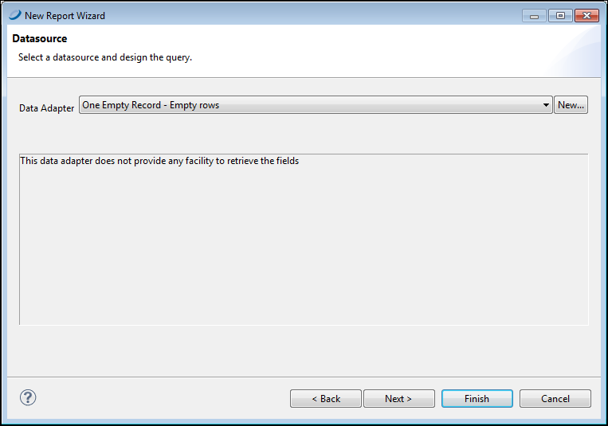
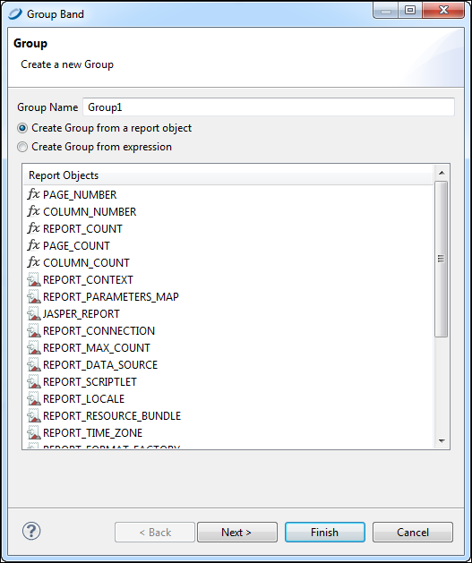
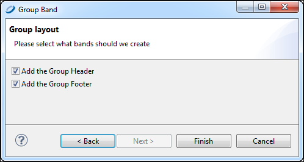
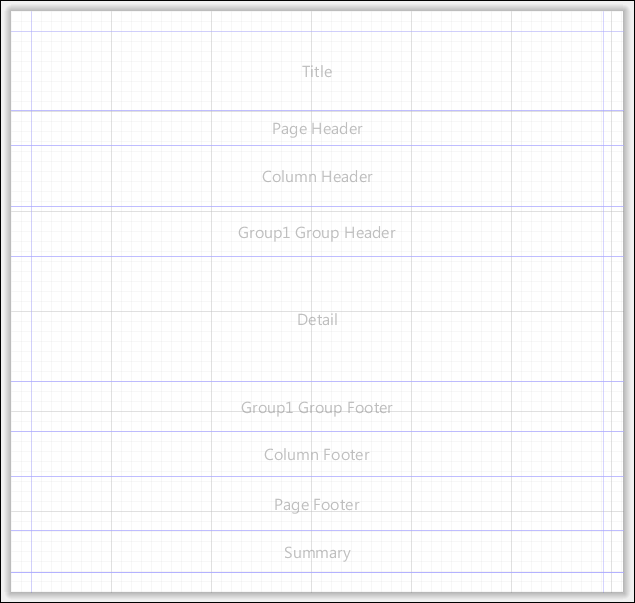
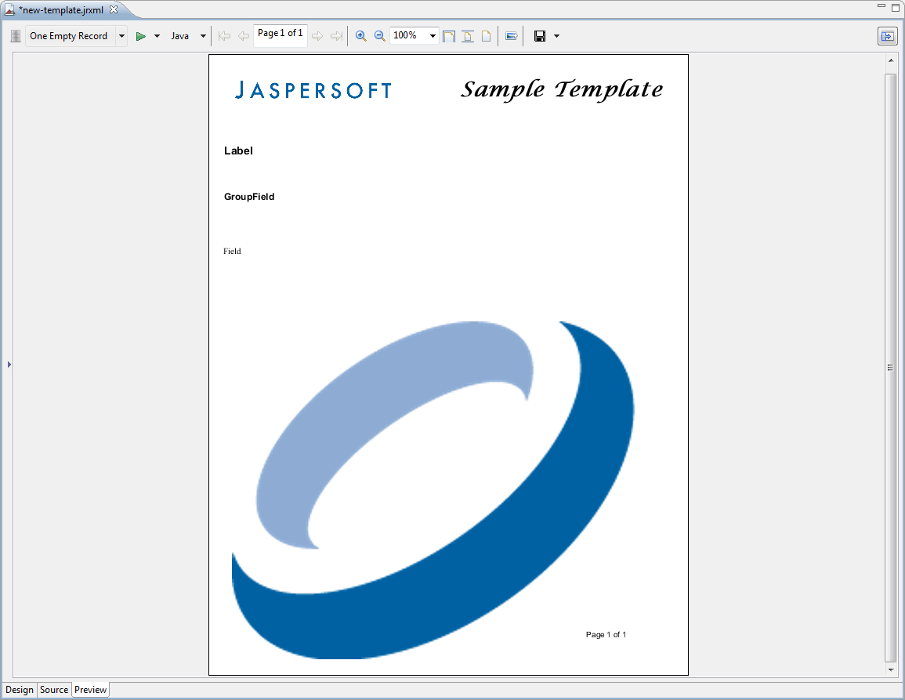

# Creating and Customizing Templates

You can create templates from scratch or edit existing templates and save them as new templates.

## Creating a New Template

If you want to start fresh with your template, create a one.

To create a template

1.  Go to **File &gt; New &gt; Jasper Report** to open the **New Report Wizard**.

2.  Select a template to start. Click **Blank Letter** and **Next**.

3.  Choose where you want to store the file, name the new template, and click **Next**.

    For creating a template, there is no need to connect to a data source.

4.  Select **One Empty Record - Empty rows** and click **Finish**.

|                                                 |
|-------------------------------------------------|
|  |
| *Figure 1: One Empty Record Data Source*        |

An empty report opens, containing the following bands:

-   Title

    -   Page Header
    -   Column Header
    -   Detail
    -   Column Footer
    -   Page Footer
    -   Summary

1.  Right-click on the report root node in the **Outline**, and select **Create Group**. The **Group Band** dialog is displayed.

    |                                                           |
    |-----------------------------------------------------------|
    |  |
    | *Figure 2: Group Band Dialog*                             |

2.  Name your group and click **Next**. The **Group Layout** dialog is displayed.

    |                                                 |
    |-------------------------------------------------|
    |  |
    | *Figure 3: Group Layout Dialog*                 |

3.  Leave both **Add the Group Header** and **Add the Group Footer** checked, and click **Finish**.

Your report is similar to the one in Figure 7‑5.

|                                                               |
|---------------------------------------------------------------|
|  |
| *Figure 4: Report Containing Group Header and Footer*         |

## Customizing a Template

Now that you have a blank template, you can customize it to suit your preference. For example, you can add your company name and logo, page numbering, add a background for your report, and set band and column sizes. You can also use this procedure to change an existing template.

To customize a template

1.  Add a graphic: Drag an **Image** element where you want the image to appear. This is usually the Title band.

    For more information about the Image element, see [Graphic Elements](elements/elements-graphic.md).

2.  Add a title: Drag a **Static Text** element to the Title band. Style the text in the Properties view. For more information about Static Text elements, see [Text Elements](elements/elements-text.md).

3.  Want the background to cover the entire page? Right-click the element in the **Outline** and choose **Maximize Band Height**. Otherwise, set the Background band to the size you want. Drag an **Image** element into the Background band to create your background.

4.  Add page numbering to the Page Footer band: Drag a **Page Number** element into the band, and place it where you want it. You can also add a **Page X of Y** element if you prefer.

5.  Want a label in the Column Header band? Add a **Static Text** element with the text “Label”.

6.  Set styles for your report’s text: Add a **Text** field to the Group Header and a **Text** field to the Detail band. Set the text of the first **Text** field to `“GroupField”` and the text of the second **Text** field to `“Field”`. Format the text as you like.

7.  Save your template file.

8.  Click the **Preview** tab. Your template should like something like the one in “Template Preview”.

|                                                         |
|---------------------------------------------------------|
|  |
| *Figure 5: Template Preview*                            |
