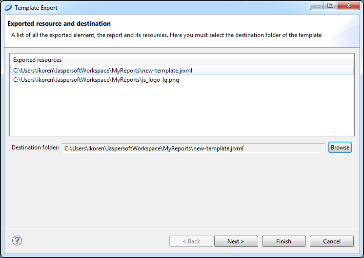
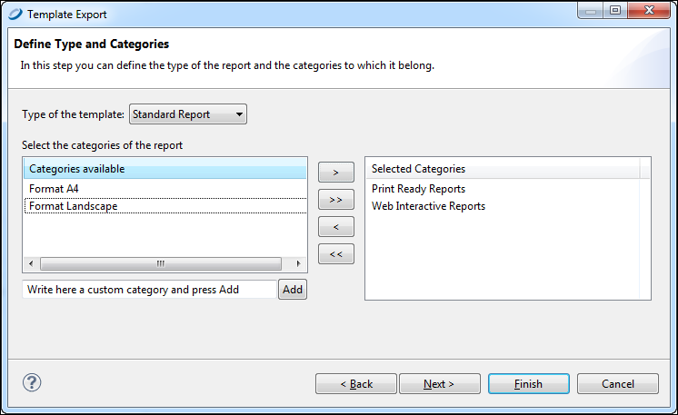

# Saving Templates

Jaspersoft Studio templates require a flat folder structure (resources and reports in the same folder). This way, when you export a template, the paths and resources in the exported report point to the same directory.

## Creating a Template Directory

You can specify one or more directories for your custom templates.

1.  Go to **Window &gt; Preferences &gt; Jaspersoft Studio &gt;Resource Folders Locations &gt; Report Templates Locations**.

    |  |
    |----|
    |  |
    | *Figure 1: Template Location Preferences* |

2.  Click the **New...** button and navigate to the directory in which you want to store your template.

3.  Click the **Apply** button.

4.  Click **OK**.

## Exporting a Template

Save your template for future use.

1.  Go to **File &gt; Export as Report Template**. The **Template Export** dialog opens.

    |                                                       |
    |-------------------------------------------------------|
    |  |
    | *Figure 2: Template Export Dialog*                    |

2.  Click the **Browse** button and navigate to the directory where you want to save your template. Click **Next**.

    The **Define Type and Categories** dialog opens.

    |                                                                     |
    |---------------------------------------------------------------------|
    |  |
    | *Figure 3: Define Type and Categories Dialog*                       |

3.  In the drop-down, choose whether the template type is a Standard Report or a Table-Based report.

    This selection is used to validate the report. For example, by selecting **Standard Report**, the validation process searches for the group field with the text group or for the column header label with the text label. If any of the required fields are not found, an error message is displayed.

4.  Select the categories for the template available and use the arrow button to add them to the **Selected Categories**.

5.  Click **Finish**.

## Creating a Template Thumbnail

Saving a thumbnail is not required, but can be helpful if more than one person uses your templates.

1.  Go to the **Preview** tab.
2.  Click the Export Image button. 
3.  Save the image in the same directory and with the same name as your template.
