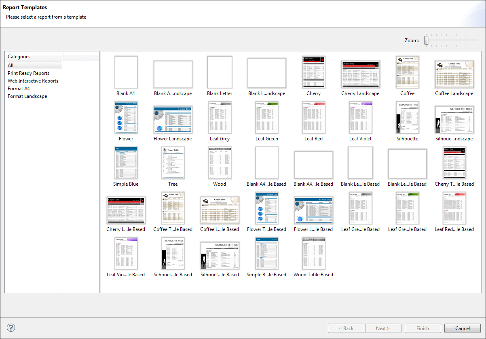

# Template Structure

A template is a JRXML file. When you create a report, Jaspersoft Studio loads the selected template's JRXML file with any modifications you have specified in the wizard. If you do not use the wizard, your template is just copied along with all the referenced images in the location you have specified.

When you open the Report Template dialog (**File \> New \> Jasper Report**) scans all paths specified as template directories. Any valid JRXML files found are included in the **Report Template** dialog. If a template provides a preview image, the image is displayed. Otherwise, a white box appears.

|                                                         |
|---------------------------------------------------------|
|  |
| *Figure 1: Default Report Templates*                    |

A template contains all or some of the same parts as a report. Remember the following when creating a template or editing an existing template:

- A report's page formatting is the page formatting of its template.

- Each band in a report is, by default, the same size as that band in its template.

- Every element placed in the **Summary**, **Title**, **Page Header** and **Page Footer** bands of a template appears in every report that uses that template.

- The **Column Header** band should contain only a **Static Text** element, and its text content must be **Label**. The appearance, font, and the other attributes of this label create every label inserted in this band.

- The **Group Header** band should contain only a **Text Field** with the string **“GroupField”** (including the double quotes). As with the **Column Header** this assumes an example to generate every field that goes in this band.

- The **Detail** band should contain only a **Text Filed** with the string “**Field**” (including the double quotes). Again, this is used to generate every field that goes in this band.

When you group data using the wizard, the wizard creates all the necessary report structures to produce your groups. The Report Wizard supports up to four groups, with a group header and group footer associated with each. If the template defines one or more groups and you group the data, the wizard tries to use any existing groups before creating a group. By default, groups in the template are deleted if they are not used. For each group, the wizard sets the group expression and adds a label for the name and a text field showing the value of the group expression (which is always a field name, because the grouping criteria set using the wizard is one of the selected fields).
