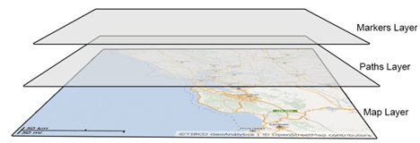
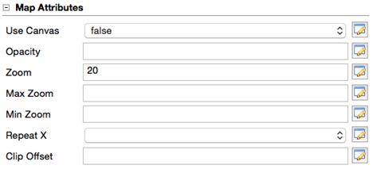
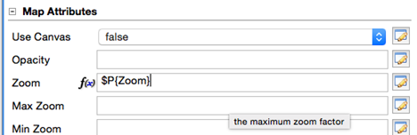
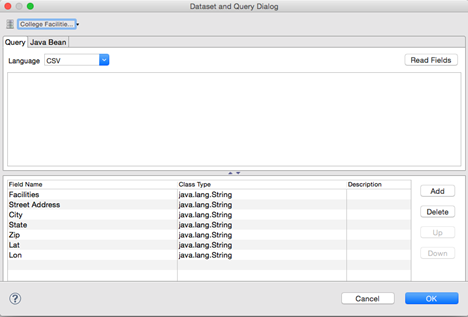
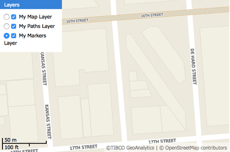
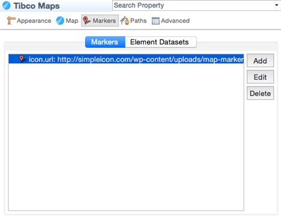
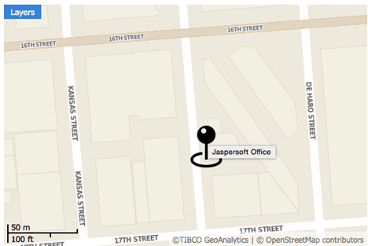
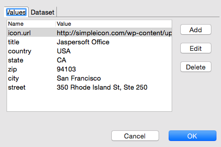
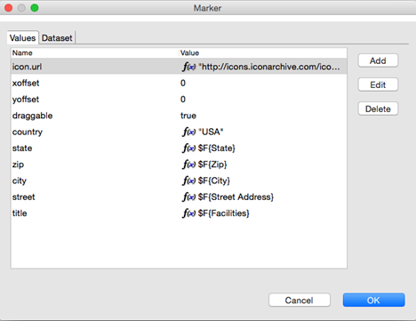
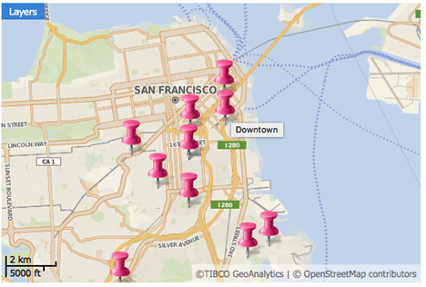

# Working with TIBCO GeoAnalytics Maps

Jaspersoft Studio uses TIBCO GeoAnalytics Maps to produce data-rich maps. This section describes their set-up and configuration, including:

- Configuring a Basic Map

- Using Expressions for Properties

- Understanding Layers

- Working with Markers

- Working with Paths

!!! info "Important"

    The features in this section may be restricted by your JasperReports Server software license. If you don't see some of the options described, your current license likely prohibits their use. Contact us to learn about your licensed features or to discuss upgrading.

In addition to the other types of map component that Jaspersoft Studio supports, TIBCO GeoAnalytics Maps are also supported. These multi-layer maps are designed for use in interactive web environments, and support both markers and paths. They also support the ability to provide a street address and resolve it to the correct latitude and longitude (sometimes called geolocation).

Because these components download content from either TIBCO's service or from Google Maps, they require a connection to the Internet. While the maps themselves are freely available, using the GeoAnalytics geolocation serve to resolve street addresses requires an additional license.

!!! warning

    These maps are well suited to web-based environments, such as HTML export or when viewed through an interactive viewer such as JasperReports Server; however, limitations in the underlying technology prevent some TIBCO GeoAnalytics Map features from working in static formats, such as PDF. In this case, the map is converted to an image, which is always downloaded from Google Maps instead of TIBCO's server. In addition, if the map's location is resolved from a street address, the canvas may be blank (or blue); this happens when the address's latitude and longitude are not available.

    If your target output format is something other than HTML, consider using the standard map component.

The map component consists of three layers: a map, a set of paths, and a set of markers. The lowest layer contains the map itself, rendered by your choice of providers: TIBCO Maps or Google Maps. In both cases, the image is formed of tiles retrieved from a remote server. The next two layers (first paths then markers) can contain paths and markers or shapes.

|                                                                     |
|---------------------------------------------------------------------|
|                        |
| *Figure 1: Basic structure of the TIBCO GeoAnalytics Map component* |

## Configuring a Basic Map

To create a TIBCO Map component

1.  First locate the component in the Palette. It uses this icon: ; drag it onto the canvas.

    At a minimum, the TIBCO Map component requires the location of the area to display, which can be defined by these manually exclusive options:

2.  The latitude and longitude of the location.

3.  The street address of the location (assuming you have a license for TIBCO GeoAnalytics geolocation services). To use this option, you must also provide credentials for TIBCO's geolocation service. You can either enter these in the Maparama Credentials section of the TIBCO map component's properties, or by defining them in the jasperreports.properties file so that they can share across multiple reports. These properties are:

    - `com.jaspersoft.jasperreports.tibco.maps.customer`: the customer name used with TIBCO GeoAnalytics Maps
    - `com.jaspersoft.jasperreports.tibco.maps.key`: the corresponding license key for the specified user

4.  To define a location, edit the TIBCO Maps component's Location properties. Entering a latitude/longitude pair or address defines a static location. You can also use parameters to define the components location and all other TIBCO Map properties dynamically.

|                                                           |
|-----------------------------------------------------------|
|  |
| *Figure 2: TIBCO Map Attributes*                          |

Map attributes determine how the map layer of the component is rendered. The attributes are all optional:

|  |  |
|----|----|
| Property | Property Value |
| Use Canvas true | false This property refers to the way that the map is rendered (by using a canvas or SVG layers) |
| Opacity | 0.0- 1.0 Level of opacity of the map. |
| Max Zoom 1 - 18 | The maximum allowed zoom |
| Min Zoom 1 - 18 | The minimum allowed zoom |
| Repeat X true \| false | Specifies whether tiles are repeated when the world's bounds are exceeded horizontally |
| Clip Offset integer | The clip offset of the map |

## Using Expressions for Properties

The simplest way to define the map layer's properties is to set them to static values. However, this is a much more limited approach than using expressions to pass parameters to the component dynamically, which allows you to evaluate the data in your data set and use the results to populate the map layer's properties. If you do not specify a different data set, the component uses the main dataset of the report. In the components properties, properties based on expressions are indicated by displaying *f(x)* next to the field, as shown below.

|                                                                  |
|------------------------------------------------------------------|
|     |
| *Figure 3: Map properties showing Zoom defined by an expression* |

To specify a different dataset to resolve the map attributes based on expressions, click the **Use Dataset** checkbox to select it, and select the dataset to use in the Dataset Run.

|  |
|----|
|  |
| *Figure 4: Defining the Dataset to use to resolve map attribute expressions* |

Data Runs are used throughout Jaspersoft Studio and its related products when a report includes a subdataset. Use a Data Run to define values for the subdataset's parameters.

## Understanding Layers

Each layer in the map component controls different aspects of the final map rendered in your report:

- The maps layer defines the map tiles that are displayed by the component's image, which are determined by its location and zoom, the maximum and minimum zoom allowed in the component, and the image's opacity.

- The marker layer defines locations on the map that display an image you select.

- The path layer defines lines between locations on the map.

Each layer can be named uniquely. These names can be displayed in the JasperReports Server interactive report viewer in the Layers dropdown; this allows your user to select which layers to drawn.

|  |
|----|
|  |
| *Figure 5: Layer names defined in the component can control the layers drawn in the final report* |

## Working with Markers

Markers are points rendered on the second layer of the TIBCO Map component.

This section describes:

- Static Markers

- Dynamic Markers

### Static Markers

1.  Edit the map component's properties.

2.  On the Markers tab, click Add.

3.  Define your marker by specifying a location and icon. The list of properties for a marker includes:

    - target
    - string
    - optional
    - \_blank
    - The hyperlink target for the marker

    |                                                       |
    |-------------------------------------------------------|
    |  |
    | *Figure 6: Defining a map's markers*                  |

4.  Specify the icon as a URL that points to the image to use. It's loaded by the JavaScript API.

    Jaspersoft does not currently support loading an image directly from the repository, or as a resource local to the report.

    The location can be set by latitude/longitude coordinates or an address to be geolocated, as described above.

    |                                                       |
    |-------------------------------------------------------|
    |  |
    | *Figure 7: A map with a marker*                       |

5.  For the addresses, set each property to form the address: country, state, zip, city, street.

|                                                                       |
|-----------------------------------------------------------------------|
|  |
| *Figure 8: Marker properties set to a static location*                |

Marker properties include:

<table>
<colgroup>
<col style="width: 20%" />
<col style="width: 20%" />
<col style="width: 20%" />
<col style="width: 20%" />
<col style="width: 20%" />
</colgroup>
<tbody>
<tr>
<td>
Property Name
</td>
<td>
Type
</td>
<td>
Required?
</td>
<td>
Possible Values
</td>
<td>
Description
</td>
</tr>
<tr>
<td>
xoffset
</td>
<td>
Numeric (integer)
</td>
<td>
Optional
</td>
<td>
0
</td>
<td>
The horizontal offset of the marker icon is measured in pixels
</td>
</tr>
<tr>
<td>
yoffset
</td>
<td>
Numeric (integer)
</td>
<td>
Optional
</td>
<td>
0
</td>
<td>
The vertical offset of the marker icon is measured in pixels
</td>
</tr>
<tr>
<td>
anchor
</td>
<td>
String
</td>
<td>
Optional
</td>
<td>
bottom-left, bottom-right, bottom-center 

</td>
<td>
The anchor point of the marker icon
</td>
</tr>
<tr>
<td>
draggable
</td>
<td>
Boolean
</td>
<td>
Optional
</td>
<td>
false
</td>
<td>
Specifies whether users can drag the marker
</td>
</tr>
<tr>
<td>
icon.url
</td>
<td>
String
</td>
<td>
Required
</td>
<td>
N/A
</td>
<td>
URL for the icon
</td>
</tr>
<tr>
<td>
title
</td>
<td>
String
</td>
<td>
Optional
</td>
<td>
N/A
</td>
<td>
The ToolTip for the marker icon; works with icon.url
</td>
</tr>
<tr>
<td>
hyperlink
</td>
<td>
String
</td>
<td>
Optional
</td>
<td>
N/A
</td>
<td>
The hyperlink text for the marker
</td>
</tr>
<tr>
<td>
target
</td>
<td>
String
</td>
<td>
Optional
</td>
<td>N/A</td>
<td>
The hyperlink target for the marker. The default value is _blank.
</td>
</tr>
</tbody>
</table>

This is a simplified example. The more common scenario is to read location data from the database.

### Dynamic Markers

The steps above define the marker as a static address known when the report was created. But it is far more useful to define the markers based on locations in your report's data dynamically. A single map can use both static and dynamic markers, and locations can be based on data from more than one data source.

In this example, we use data from the City College of San Francisco's public facilities data set that we have saved as an Excel file.

|  |  |  |  |  |  |  |
|----|----|----|----|----|----|----|
| Facilities | Street Address | City | State | Zip | Latitude | Longitude |
| Airport | SF International Airport, North Access Road, Building 928  | San Francisco | CA | 94128 | 37.622511278000445 | -122.39519978799973 |
| Civic Center | 750 Eddy Street | San Francisco | CA | 94109 | 37.783008003000475 | -122.42000284399973 |
| Castro | 450 Castro Street | San Francisco | CA | 94114 | 37.76168744600045 | -122.43511354199973 |
| Chinatown/North Beach | 808 Kearny Street | San Francisco | CA | 94108 | 37.79551773600048 | -122.40496557999973 |
| Downtown | 88 4th Street | San Francisco | CA | 94103 | 37.784588004000454 | -122.40438877299971 |
| Evans | 1400 Evans Avenue | San Francisco | CA | 94124 | 37.74169579700049 | -122.38589540299972 |
| Fort Mason | Laguna Street & Marina Boulevard, Building B | San Francisco | CA | 94123 | 37.80001344200048 | -122.43517818299972 |
| John Adams | 1860 Hayes Street | San Francisco | CA | 94117 | 37.77385843900049 | -122.4469528999997 |
| Mission | 1125 Valencia Street | San Francisco | CA | 94110 | 37.754794183000456 | -122.42088522899968 |
| Ocean | 50 Phelan Avenue | San Francisco | CA | 94112 | 37.72408746400049 | -122.45231737299969 |
| Southeast | 1800 Oakdale Avenue | San Francisco | CA | 94124 | 37.73684564000047 | -122.39424548999972 |
| Gough Street | 31/33 Gough Street | San Francisco | CA | 94103 | 37.772268634000454 | -122.42098248799971 |

Since the data set includes both street addresses and latitude/longitude pairs, we can explore both functions.

To use dynamic locations

1.  Create an Excel file with the data provided above and a data adapter that points to it. Export the data adapter to the project folder; name it CollegeFacilities.jrdax.

2.  In the report, create a dataset: right-click the root in the outline view and select **Create Dataset**.

3.  Right-click the new dataset and select **Dataset and Query**.

4.  In the **Query** dialog, select the CollegeFacilities.jrdax data adapter and click **Read Fields**.

5.  By default, the fields are all set as type String. To change the Latitude field to a Float, double-click in the Class Type column, click the button ellipsis**...**, and select java.lang.Float from the type menu. Repeat these steps to set the Longitude data type to Float.

6.  Click **OK**.

7.  Use the data adapter to populate the dataset. With the CollegeFacilities dataset selected in the outline view, click the **Advanced** tab in the **Properties** view, then select the property **Properties** and click the button ellipsis to open the **Properties** dialog.

8.  Add a property: `net.sf.jasperreports.data.adapter`, and specify the name of the data adapter file saved earlier (CollegeFacilities.jrdax).

    We can use this new dataset to set markers on the map.

9.  Select the map in the **Design** tab, click the **Markers** tab, and click **Add**.

10. Click **Dataset**, check the **Use Dataset** checkbox, and click **Add**.

11. Select the CollegeFacilities dataset and accept the defaults. Studio uses the data adapter referenced by the `net.sf.jasperreports.data.adapter` property set previously for this dataset.

12. Click **OK**.

    The dataset is added to the list of datasets that we use for markers.

13. Click **Values** and create an expression for each marker property. For example, provide the title, street, city, state, country.

    |                                                                     |
    |---------------------------------------------------------------------|
    |  |
    | *Figure 9: Location values defined as expressions*                  |

    This example uses an icon from the web: [Pink Push Pin](http://icons.iconarchive.com/icons/icons-land/vista-map-markers/48/Map-Marker-Push-Pin-1-Pink-icon.png).

14. Click **OK**.

15. Preview your report in HTML.

|                                                                    |
|--------------------------------------------------------------------|
|       |
| *Figure 10: San Francisco City College facilities marked on a map* |

## Working with Paths

Paths are lines rendered on the third layer of the TIBCO Map component. A path is defined by:

- A name that serves as a path identifier in case different paths appear on the map.

- A style that specifies various style configuration properties, such as line and fill color, line weight, and opacity.

- A collection of places (points) on the map defined by latitude/longitude coordinates or addresses. These are connected to form the path.

To define a path in Jaspersoft Studio

1.  On the **Paths** tab, use the Styles section to define a style to associate with the path: click Add to do so.

    Style properties can be added manually or by specifying a dataset. The style name sets the style property when adding points to the path.

2.  Use the **Paths** section to add points to the path: click **Add** in this UI area to do so. For each point, specify:

    1.  The path name (to identify which path includes the point)
    2.  The style property (to identify the style associated with this path)
    3.  The latitude/longitude coordinates or the address of the point

Like styles, points can be added manually or by using a specific dataset. Pay close attention when adding points. They are connected on the map in the order that they are declared in the JRXML file. If they are not declared in a sensible order, the path does not make sense, either.
